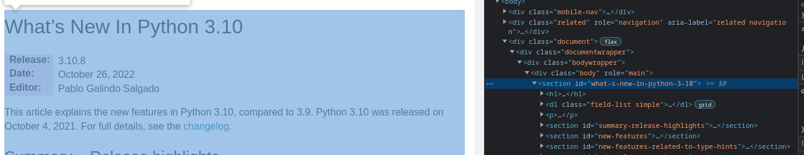

# Парсер документации актуальной версии Python (stable) и статусов PEP

В проекте реализованно:
 - Парсинг данных (**BeautifulSoup**);
 - Кеширвание первичного запроса (**Requests_cache**);
 - Сбор логов на этапах парсинга (**Logging**);
 - Отслеживание переданных аргументов в командной строке (**Argparse**);
 - Вывод таблицы в красивом формате в консоль (**PrettyTable**);
 - Прогресс-бар для отслеживание процесса парсинга (**Tqdm**).


## Что делает

Парсинг актуальных версий и описаний для Python и статусов PEP. А также скачивание официальной документации (стабильной версии) для дальнейшего самостоятельного ознакомления.


## Запуск

Для запуска парсера, нужно передать в командную строку один из трех обязательных позиционных аргументов:
 - `whats-new` - Показыввает описание версии и автора;
 - `latest-versions` - Показывает версию и её статус;
 - `download` - Скачивает документацию по последней **stable** версии;
 - `pep` - Показывает статусы PEP документаций.

В командной строке можно также передать **необязательные** параметры:
 - `-c` или `--clear-cache` - Очищает кеш после предыдущего запуска команды;
 - `-o pretty или file` или `--output pretty или file` - Вывод результата запроса в файл или в удобной таблице прям в терминале.

Файлы документации сохраняются в директории `downloads`.

Отчеты с результатами парсинга (в формате **csv**) сохраняются в директории `results`.

Логи с информацией о работе парсинга расположены в директории `logs`.


## Пример работы парсера

Пример команды:

```bash
python main.py latest-versions -o pretty -c
```


## Авторство

Парсинг сайта документации PEP и Python описан мной (Будаевым Дмитрием). 

Тесты написаны командой Яндекс.Практикума, с одним небольшим изменением. Подробности ниже.

Не корректо описан html блок. В тестах он проверяется, как `<div class="section" ...` :

```python
...
def test_find_tag(soup):
    got = utils.find_tag(soup, 'div', attrs={'id': 'what-s-new-in-python'})
    assert isinstance(got, bs4.element.Tag), (
        'Функция `find_tag` в модуле `utils.py` должна возвращать искомый тег'
    )
    assert (
        '<div class="section" id="what-s-new-in-python">' in got.__str__()
    ), (
        'Функция `find_tag` модуля `utils.py` '
        'не вернула ожидаемый <div> с `id=what-s-new-in-python`'
    )
...
```

Но на сайте, этот блок указан, как просто `<section ... `.




После внесения необходимых изменений - тесты пройдены:


